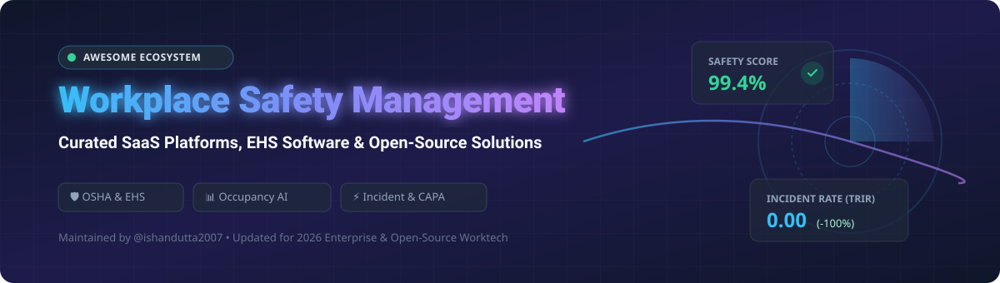
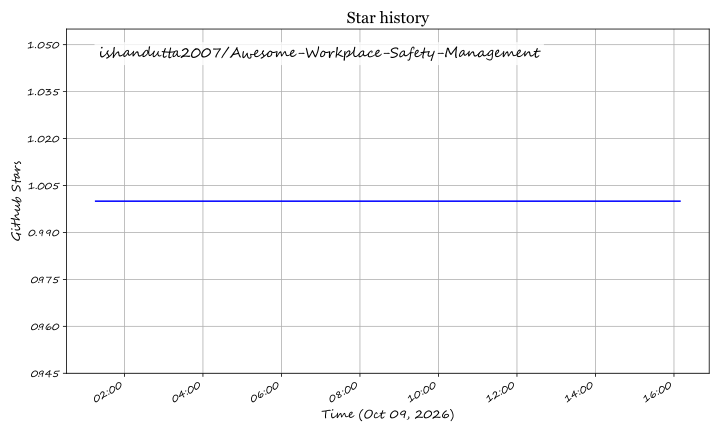

  

# 📊 Awesome Visual Data Analytics 🚀

  
  
  
  
  
  

## 🌐 Top Visual Data Analytics & Business Intelligence Ecosystem 📈

> **Curated List of Enterprise SaaS Platforms, Open-Source GitHub Projects, Self-Hosted Analytics & Modern Data Visualization Frameworks**  
> *Everything you need for Business Intelligence (BI), SQL-native reporting, interactive dashboarding, agentic analytics, and embeddable visual data apps.*  
> **Last updated: October 2026** 📅

---

## 💡 Overview & Market Landscape

This repository provides an extensive, SEO-optimized directory of **commercial visual data analytics SaaS suites** and **open-source analytics engines** that enable data teams, developers, and business stakeholders to visualize, query, and act on data.

Whether building real-time telemetry dashboards with **Grafana**, self-service analytics with **Metabase**, modern dbt-driven metric layers with **Lightdash**, or deploying enterprise visual analytics platforms like **Tableau** and **Power BI**, this list provides complete pricing, open-source metrics, licensing, and capabilities.

---

## 📚 Table of Contents

- [🏢 Enterprise SaaS & Hosted BI Platforms](#-enterprise-saas--hosted-bi-platforms)
- [⚡ Open-Source GitHub Projects (Ranked by Stars)](#-open-source-github-projects-ranked-by-stars)
  - [📊 Full-Featured BI & Dashboarding Platforms](#-full-featured-bi--dashboarding-platforms)
  - [⚡ Developer-First & Embedded Analytics](#-developer-first--embedded-analytics)
  - [🚀 High-Performance Analytical Databases](#-high-performance-analytical-databases)
  - [🎨 Data Visualization & Charting Libraries](#-data-visualization--charting-libraries)
- [🤝 How to Contribute](#-how-to-contribute)
- [❤️ Support & Sponsorship](#-support--sponsorship)
- [⚠️ Disclaimer & Security Guidelines](#%EF%B8%8F-disclaimer--security-guidelines)
- [📈 Star History](#-star-history)

---

## 🏢 Enterprise SaaS & Hosted BI Platforms 💼

The visual data analytics market is estimated at **$15.7 billion in 2026** and projected to reach **$32.5 billion by 2031**, exhibiting a **highly concentrated market structure** dominated by mega-cap cloud platform leaders (Microsoft, Google, Salesforce) while specialized independent vendors occupy high-value niches.

| Platform | Description & Key Strengths 🌟 | Starting Pricing 💵 | Free Tier / Trial Limit 🎁 | Company Size (Revenue / Valuation) 🏛️ |
| :--- | :--- | :--- | :--- | :--- |
| **[Looker (Google Cloud)](https://looker.com/)** | Governed LookML semantic modeling layer and enterprise BI. (Includes free Looker Studio for basic visual reporting). | $9/user/month (Looker Studio Pro); Enterprise Looker from $60,000/yr | 30-day free trial (Looker Core) / Looker Studio free forever | Market Cap: **$4.28 Trillion** (Parent: Alphabet; Rev: $350B+/yr) |
| **[Microsoft Power BI](https://powerbi.microsoft.com/)** | Deeply integrated with Excel, Azure, and Microsoft 365 with Copilot AI. Best for Microsoft-centric enterprise ecosystems. | $10/user/month (Pro plan) | 60-day free trial (Pro features) | Market Cap: **$3.93 Trillion** (Parent: Microsoft; Rev: $331.8B/yr) |
| **[Salesforce Tableau](https://www.tableau.com/)** | Enterprise visual analytics standard with drag-and-drop interface, Tableau Pulse AI insights, and Tableau Next agentic workflows. | $15/user/month (Viewer); $75/user/month (Creator) | 14-day free trial (Tableau Cloud) / Tableau Public free for public datasets | Market Cap: **$280 Billion** (Salesforce acquisition: $15.7B) |
| **[Qlik Sense](https://www.qlik.com/)** | Associative analytics engine for exploring hidden data relationships across complex enterprise sources. | $300/month (Standard plan) | 30-day free trial | Valuation: **$10 Billion** (Rev: ~$1 Billion/yr) |
| **[TIBCO Spotfire](https://www.tibco.com/products/tibco-spotfire)** | Advanced predictive analytics and location intelligence for scientific, industrial, and engineering data. | $65/user/month (Estimated Spotfire Analytics tier) | 30-day free trial (Spotfire Industry Pro) | Acquisition Value: **$8.0 Billion** (Parent: Cloud Software Group / Thoma Bravo) |
| **[ThoughtSpot](https://www.thoughtspot.com/)** | Natural language search-driven analytics powered by SpotIQ AI engine. | $25/user/month (Essentials plan) | 14-day free trial (max 5M rows / 1M export limit) | Valuation: **$4.2 Billion** (ARR: $150 Million+) |
| **[Sigma Computing](https://www.sigmacomputing.com/)** | Spreadsheet-native interface operating directly on Snowflake, Databricks, and BigQuery cloud data warehouses. | $61,000/year (Estimated entry-level enterprise contract) | 7-day free trial (no credit card required) | Valuation: **$3.0 Billion** (ARR: $200 Million+) |
| **[Sisense](https://www.sisense.com/)** | Embedded analytics platform featuring fusion data engine and in-chip technology for product embedding. | $25,000/year (Estimated entry-level contract) | 14-day free trial (Self-Serve tier) | Valuation: **$1.1 Billion** (ARR: $185 Million) |
| **[Domo](https://www.domo.com/)** | Business-user-driven cloud BI platform with 1,000+ connectors, Magic ETL, and low-code app framework. | $30,000/year (Estimated entry-level contract) | 30-day free trial (unlimited credits for core features) | Acquisition Value: **$400 Million** (Progress acquisition in 2026; Rev: $318.9M) |
| **[GoodData](https://www.gooddata.com/)** | Headless composable analytics platform built for developer-first embedded BI at scale. | $1,000/month (Platform base fee + workspace fee) | 30-day free trial (100MB per workspace limit) | Valuation: **$311 Million** (Total Funding: $167.7M; Rev: ~$63M) |

---

## ⚡ Open-Source GitHub Projects (Ranked by Stars) 🌟

Visual data analytics is one of the strongest open-source domains. Below are top-tier open-source GitHub repositories sorted by **GitHub Stars_Count** (descending), complete with live social Stars_Badges linking directly to each project's stargazers page.

### 📊 Full-Featured BI & Dashboarding Platforms

- **[Grafana](https://github.com/grafana/grafana)**  🌟  
  **The de facto standard for open-source operational dashboards and observability**, AGPL-3.0 licensed with **77,000+ stars**. Connects to 100+ data sources including Prometheus, Loki, Elasticsearch, PostgreSQL, MySQL, and ClickHouse. Features rich visualization panels, annotations, ML-powered alerting, and multi-tenant access controls.

- **[Apache Superset](https://github.com/apache/superset)**  🌟  
  **The leading open-source modern data exploration and visualization platform**, Apache-2.0 licensed with **75,000+ stars**. Superset 5.0 delivers 60+ chart types, a SQL IDE with Jinja templating, granular security control, and an AI-powered intelligence layer with an MCP server for LLM integration.

- **[Metabase](https://github.com/metabase/metabase)**  🌟  
  **Self-service no-code business intelligence platform**, AGPL-3.0 licensed with **49,500+ stars**. Enables non-technical users to build queries visually without SQL, generate automated drill-downs, and share interactive dashboards, alerts, and Slack subscriptions.

- **[Redash](https://github.com/getredash/redash)**  🌟  
  **SQL-driven visualization and dashboarding platform**, BSD-2-Clause licensed with **28,800+ stars**. Connect to dozens of SQL and NoSQL data sources, write queries with auto-complete, create visualizations, and share dashboards across teams.

- **[Lightdash](https://github.com/lightdash/lightdash)**  🌟  
  **Agentic BI and open-source Looker alternative for dbt users**, MIT licensed with **6,100+ stars**. Built directly on dbt semantic models, allowing data teams to define metrics once in YAML and empower business users to explore metrics safely.

---

### ⚡ Developer-First & Embedded Analytics

- **[Streamlit](https://github.com/streamlit/streamlit)**  🌟  
  **Python framework for building custom interactive data apps**, Apache-2.0 licensed with **45,900+ stars**. Turns Python data scripts into shareable web applications in minutes without requiring frontend web development experience.

- **[Cube](https://github.com/cube-js/cube)**  🌟  
  **Universal open-source semantic layer for AI, BI, and embedded analytics**, MIT licensed with **20,900+ stars**. Connects any data source to any frontend API (REST, GraphQL, SQL, MDX) with centralized metric definition, caching, and row-level security.

- **[Evidence.dev](https://github.com/evidence-dev/evidence)**  🌟  
  **Business intelligence as code using Markdown and SQL**, MIT licensed with **6,900+ stars**. Allows developers to build fast, interactive, version-controlled analytics reports directly inside git workflows.

- **[Vega-Lite](https://github.com/vega/vega-lite)**  🌟  
  **Concise grammar of interactive graphics**, BSD-3-Clause licensed with **5,500+ stars**. Enables declarative specification of visualizations in JSON format for quick exploration and multi-view interactive graphics.

- **[Rill Data](https://github.com/rilldata/rill)**  🌟  
  **Fast operational BI tool for event-stream and columnar data**, Apache-2.0 licensed with **2,900+ stars**. Combines DuckDB and ClickHouse to deliver instant, code-first dashboards over local files or cloud data lakes.

- **[Perses](https://github.com/perses/perses)**  🌟  
  **CNCF dashboard and visualization project**, Apache-2.0 licensed with **2,400+ stars**. Designed as an open GitOps-friendly standard for dashboard-as-code in Kubernetes and Cloud Native environments.

---

### 🚀 High-Performance Analytical Databases

- **[ClickHouse](https://github.com/ClickHouse/ClickHouse)**  ⚡  
  **The leading open-source columnar DBMS for real-time analytics**, Apache-2.0 licensed with **50,300+ stars**. Delivers sub-second SQL queries over petabytes of data with high compression and real-time streaming ingestion.

- **[DuckDB](https://github.com/duckdb/duckdb)**  ⚡  
  **In-process SQL OLAP database engine ("SQLite for Analytics")**, MIT licensed with **41,900+ stars**. Vectorized execution engine optimized for zero-dependency analytical queries on Parquet, CSV, and DuckDB files directly inside Python, R, and WASM.

- **[Apache Doris](https://github.com/apache/doris)**  ⚡  
  **Real-time analytical database for sub-second reporting**, Apache-2.0 licensed with **16,000+ stars**. Supports real-time data ingestion, point lookup, and complex SQL joins at scale across massive data warehouses.

- **[StarRocks](https://github.com/StarRocks/starrocks)**  ⚡  
  **Next-generation sub-second MPP query engine**, Apache-2.0 licensed with **12,100+ stars**. Optimized for multi-table real-time join queries, data lakehouse acceleration, and unified analytics.

---

### 🎨 Data Visualization & Charting Libraries

- **[D3.js](https://github.com/d3/d3)**  🎨  
  **The definitive JavaScript library for custom data-driven documents**, ISC licensed with **113,700+ stars**. Brings data to life using HTML, SVG, and Canvas with unmatched expressive power.

- **[Apache ECharts](https://github.com/apache/echarts)**  🎨  
  **Powerful interactive charting and data visualization library**, Apache-2.0 licensed with **67,400+ stars**. Provides smooth 2D/3D charts, WebGL rendering, and responsive canvas rendering.

- **[Bokeh](https://github.com/bokeh/bokeh)**  🎨  
  **Interactive visualization library for Python in modern web browsers**, BSD-3-Clause licensed with **20,400+ stars**. Renders high-performance interactive graphics for large streaming datasets.

- **[Plotly.py](https://github.com/plotly/plotly.py)**  🎨  
  **Interactive declarative graphing library for Python**, MIT licensed with **18,800+ stars**. Supports over 40 chart types including 3D plots, financial charts, and scientific maps.

- **[Jupyter Notebook](https://github.com/jupyter/notebook)**  🎨  
  **Web-based interactive computing environment**, BSD-3-Clause licensed with **13,400+ stars**. Combines executable code, rich data visualization plots, narrative text, and LaTeX math.

- **[Altair](https://github.com/altair-viz/altair)**  🎨  
  **Declarative statistical visualization library for Python**, BSD-3-Clause licensed with **10,400+ stars**. Built on top of Vega-Lite for clean, concise statistical charting.

- **[Apache Zeppelin](https://github.com/apache/zeppelin)**  🎨  
  **Web-based notebook for data-driven interactive analytics**, Apache-2.0 licensed with **6,600+ stars**. Deeply integrated with Apache Spark, SQL, Python, and shell interpreters.

---

## 🤝 How to Contribute 🛠️

Contributions are welcome! Follow these steps to submit new SaaS platforms or open-source visual data analytics projects:

1. 🍴 **Fork the repository** on GitHub.
2. 📝 **Edit `README.md`** adding your tool under the appropriate section with correct markdown formatting.
3. 🔗 **Include required metadata**: Name, official link, stargazers Stars_Badge (for open source), 1–2 sentence factual summary, pricing tier, and licensing.
4. 🚀 **Submit a Pull Request** with a descriptive title (e.g., `Add ProjectName to Open-Source BI`).

Read our curated guidelines at [Awesome-Awesome-Awesome](https://github.com/ishandutta2007/Awesome-Awesome-Awesome).

---

## ❤️ Support & Sponsorship ☕

If you find this visual data analytics directory helpful for your team or organization, consider supporting the maintainer:

*   ⭐ **Star this repository** on GitHub to increase visibility.
*   🔀 **Fork & Share** with fellow data engineers, BI architects, and analysts.
*   ☕ **Buy Me a Coffee / Sponsor**: Support ongoing maintenance via [GitHub Sponsors](https://github.com/sponsors/ishandutta2007).

  

---

## ⚠️ Disclaimer & Security Guidelines 🔐

- **Community-Curated List**: This directory is maintained for educational and reference purposes and does not imply official endorsement.
- **Data Governance & PII**: Visual analytics platforms connect to mission-critical business data. Ensure appropriate security controls, encryption, RBAC, and SOC2/GDPR compliance before deploying self-hosted or SaaS BI engines.
- **TCO Variation**: Commercial platforms range from $10/user/month (Power BI Pro) to $60,000+/year base contracts (Looker/Sigma). Open-source solutions eliminate licensing fees but require infrastructure, engineering, and maintenance investment.

---

## 📈 Star History

---

  <b>Made with ❤️ for Data Analysts, BI Engineers, and Data Analytics Sovereignty.</b> 
  <i>Let's make visual data analytics more open, transparent, and accessible!</i>

## Star History

<a href="https://star-history.com/#ishandutta2007/Awesome-Workplace-Safety-Management&Timeline" align="center">
  <picture>
    <source media="(prefers-color-scheme: dark)" srcset="assets/ishandutta2007_Awesome-Workplace-Safety-Management_growth.svg">
    
  </picture>
</a>
